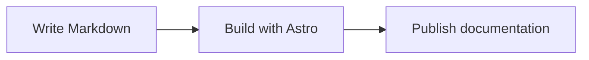

Dahlia renders fenced `mermaid` code blocks through
`@prosefly/astro-components`. Mermaid is enabled by default and follows the
page's light or dark appearance.

````md

````


Mermaid supports flowcharts, sequence diagrams, class diagrams, state diagrams,
and other diagram types documented by Mermaid. Keep labels concise and provide
nearby prose when a diagram carries information that must also be accessible
without the visual rendering.

Disable Mermaid conversion when a site wants to display the source as code:

```ts title="astro.config.ts"
import { defineConfig } from 'astro/config';
import dahlia from '@prosefly/astro-theme-dahlia';

export default defineConfig({
  integrations: [
    dahlia({
      markdown: {
        mermaid: false,
      },
    }),
  ],
});
```
