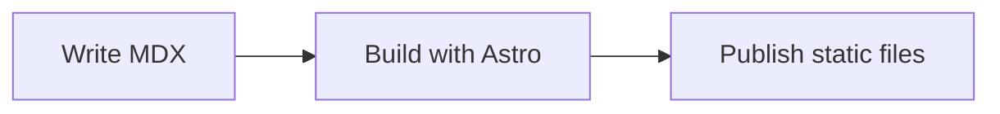
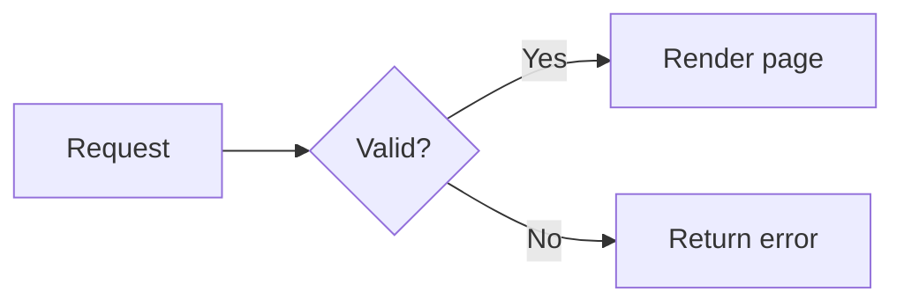
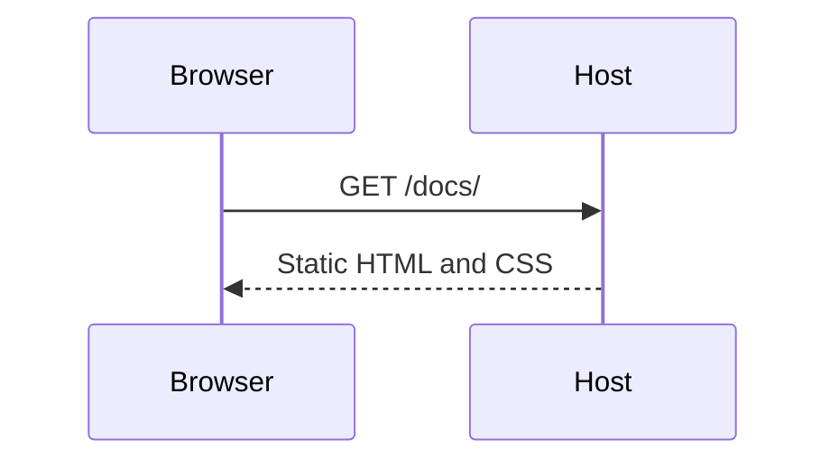
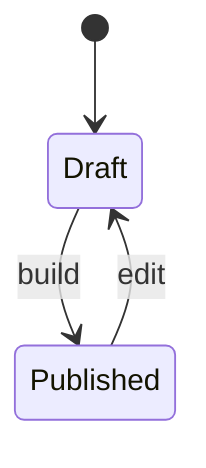
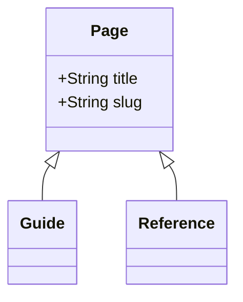
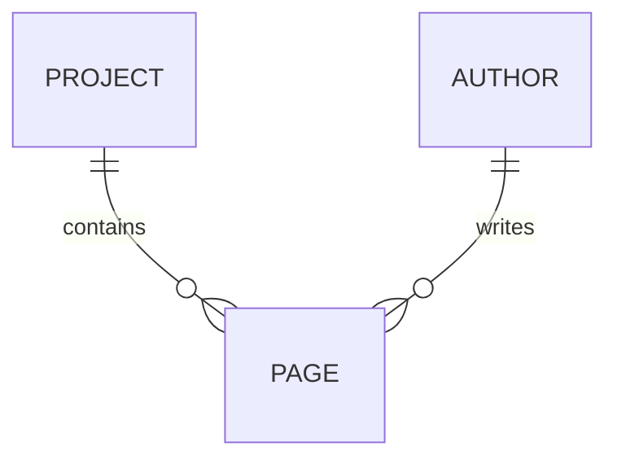
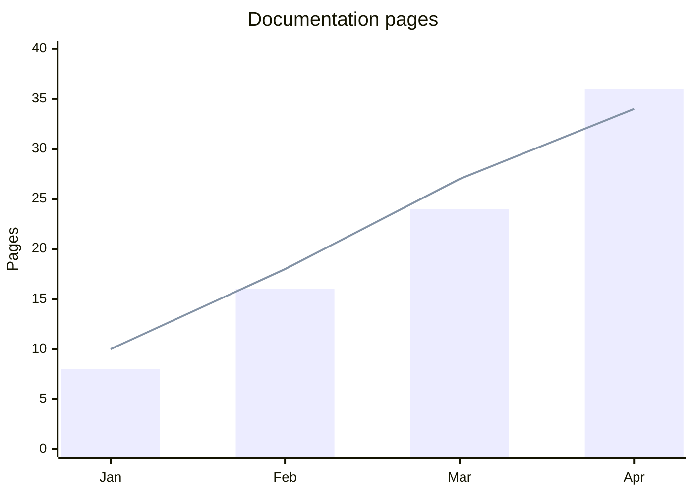

import { Callout } from '@prosefly/astro-components';

Dahlia converts fenced `mermaid` code blocks into static SVG diagrams during
the Astro build. Mermaid rendering is enabled by default through
`@prosefly/astro-components`.

## Quick start

Use a fenced code block with `mermaid` as the language:

````md

````


The optional `title` metadata becomes the accessible SVG title. Use a short,
specific title whenever the diagram communicates information that is not fully
described by nearby text.

## Rendering model

Dahlia handles a Mermaid block as follows:

1. Astro parses the fenced block as `<pre><code class="language-mermaid">`.
2. Dahlia excludes `mermaid` from Shiki and Expressive Code syntax highlighting.
3. A rehype transform renders the source with `beautiful-mermaid` during content
   processing.
4. The code block is replaced by a `<figure class="pf-mermaid">` containing a
   sanitized SVG.

The published page does not download Mermaid or render the diagram in the
browser. This avoids client-side layout shifts and keeps diagrams visible when
JavaScript is disabled.

Diagram colors reference Dahlia's CSS variables. Light and dark mode changes
therefore update an existing SVG without rerendering it.

## Supported diagram types

Dahlia's static renderer currently supports six Mermaid diagram families:

| Diagram | Opening directive | Typical use |
| --- | --- | --- |
| Flowchart | `flowchart` or `graph` | Processes, decisions, and architecture |
| Sequence | `sequenceDiagram` | Requests and interactions over time |
| State | `stateDiagram-v2` | Lifecycles and state transitions |
| Class | `classDiagram` | Types, members, and inheritance |
| Entity relationship | `erDiagram` | Data entities and relationships |
| XY chart | `xychart-beta` | Bar, line, and combined numeric charts |

<Callout type="warning" title="Mermaid.js compatibility">
  Dahlia does not ship the full Mermaid.js browser renderer. Diagram families
  outside the table—such as Gantt, pie, mind map, timeline, Git graph, journey,
  quadrant, and Sankey diagrams—are not currently supported.
</Callout>

## Flowcharts

Use `flowchart` or `graph`, followed by a direction:

- `TD` or `TB`: top to bottom
- `BT`: bottom to top
- `LR`: left to right
- `RL`: right to left

````md

````


Common node forms include `[Rectangle]`, `(Rounded)`, `{Decision}`, and
`((Circle))`. Edge labels use `-->|Label|`.

## Sequence diagrams

Use sequence diagrams to show messages between participants. Solid arrows use
`->>` and dashed responses use `-->>`.

````md

````


## State diagrams

Use `stateDiagram-v2` for finite states. `[*]` represents the initial or final
state.

````md

````


## Class diagrams

Class diagrams describe types, members, and relationships. Use `+`, `-`, and
`#` to document public, private, and protected members.

````md

````


## Entity relationship diagrams

ER diagrams use Mermaid cardinality markers such as `||`, `o{`, and `|{`.

````md

````


## XY charts

Use `xychart-beta` for bar charts, line charts, or both. The x-axis can contain
categories or a numeric range; the y-axis can include a title and explicit
range.

````md

````


Multiple `bar` or `line` declarations create multiple series. Horizontal charts
use `xychart-beta horizontal`.

## Titles and accessibility

Every generated SVG has `role="img"`, `focusable="false"`, and an accessible
`<title>`. Dahlia chooses the title in this order:

1. The fenced block's `title="..."` metadata.
2. A generic title inferred from the diagram family, such as “Mermaid sequence
   diagram” or “Mermaid class diagram.”

The SVG title identifies the graphic but does not explain all relationships.
Summarize the conclusion in prose and do not make a diagram the only source of
essential instructions.

## Theme and layout

Generated diagrams use the shared Prosefly theme variables mapped to Dahlia's
active appearance:

- background and surface
- primary and muted text
- accent color
- borders and connector lines
- sans-serif and monospace fonts

The SVG is responsive, centered, and constrained to the article width. The
wrapper scrolls horizontally when a diagram cannot shrink enough for a narrow
screen.

Use project CSS for spacing or minimum-width adjustments:

```css
.pf-mermaid {
  margin-block: 2rem;
}

.pf-mermaid > svg {
  min-width: 36rem;
}
```

Prefer Dahlia's [appearance settings](/docs/configuration/appearance/) and
[theme tokens](/docs/references/theme-tokens/) for colors so diagrams remain
consistent with the rest of the site.

## Generated SVG safety

Before inserting rendered SVG, Dahlia:

- removes scripts, iframes, embedded objects, external stylesheet links, and
  `foreignObject` content;
- removes event-handler attributes and unsafe JavaScript URLs or CSS
  expressions;
- replaces renderer font declarations with Prosefly font variables; and
- prefixes SVG IDs and references so multiple diagrams cannot collide on one
  page.

## Disable Mermaid rendering

Set `markdown.mermaid` to `false` when Mermaid source should remain a normal
code block:

```ts title="astro.config.ts"
import { defineConfig } from 'astro/config';
import dahlia from '@prosefly/astro-theme-dahlia';

export default defineConfig({
  integrations: [
    dahlia({
      markdown: {
        mermaid: false,
      },
    }),
  ],
});
```

The JSON schema also accepts the equivalent setting in `theme.config.json`:

```json title="theme.config.json"
{
  "markdown": {
    "mermaid": false
  }
}
```

## Troubleshooting

### The block renders as highlighted source

Confirm the fence language is exactly `mermaid` and Mermaid has not been
disabled. A typo such as `mermaidjs` is treated as an ordinary code language.

### The build reports `Failed to render Mermaid diagram`

The error includes the source file and line when available. Check the opening
directive first, then reduce the diagram until the failing statement is clear.
Also confirm that the diagram family is in the supported-types table above.

### A diagram is too wide

Prefer `TD` for a wide flowchart, shorten labels, or split one large diagram
into smaller diagrams. The wrapper allows horizontal scrolling as a fallback.

### Colors do not match a custom theme

Customize Dahlia's public color tokens instead of targeting generated SVG
elements. Generated class names and internal SVG structure are implementation
details and may change between renderer versions.
